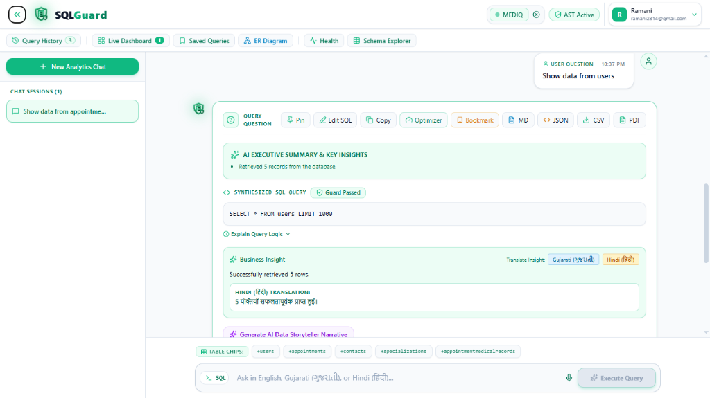
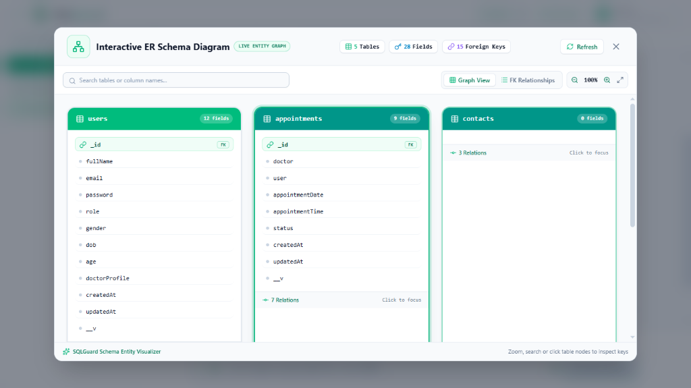
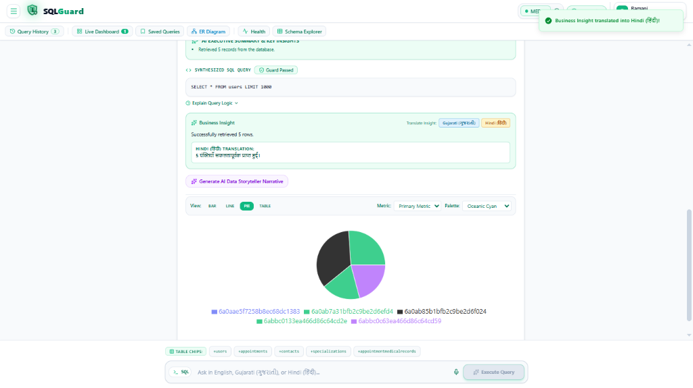
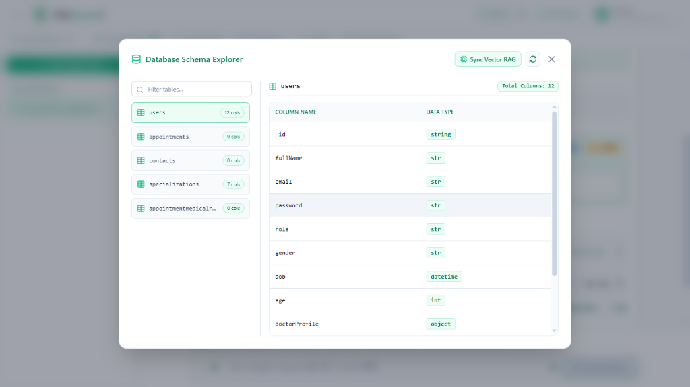
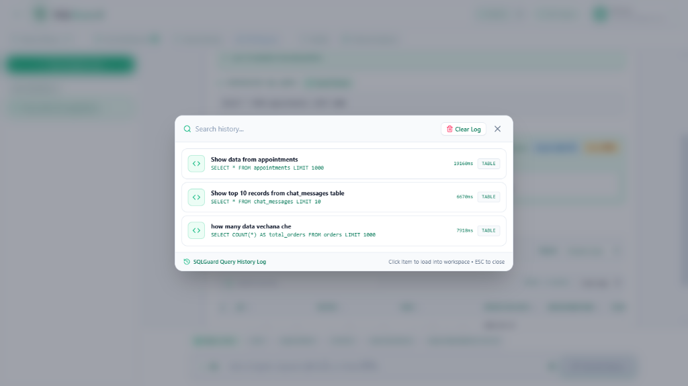
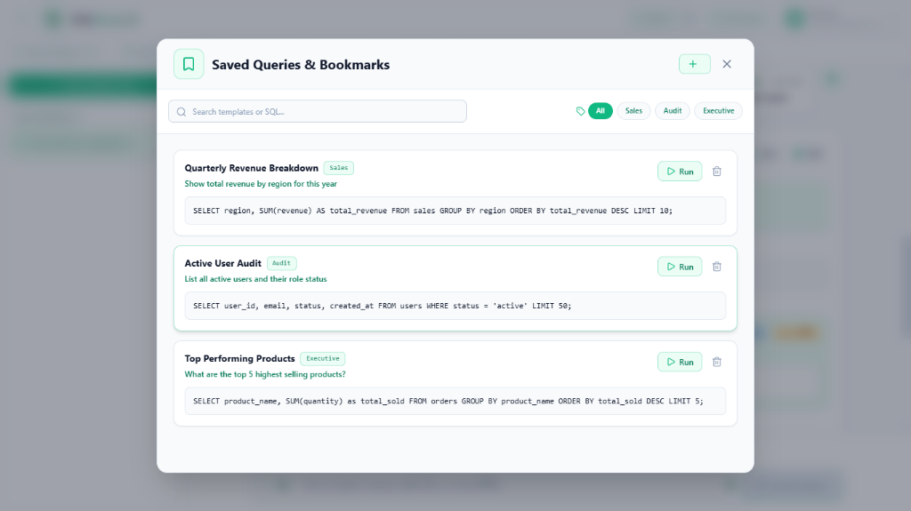
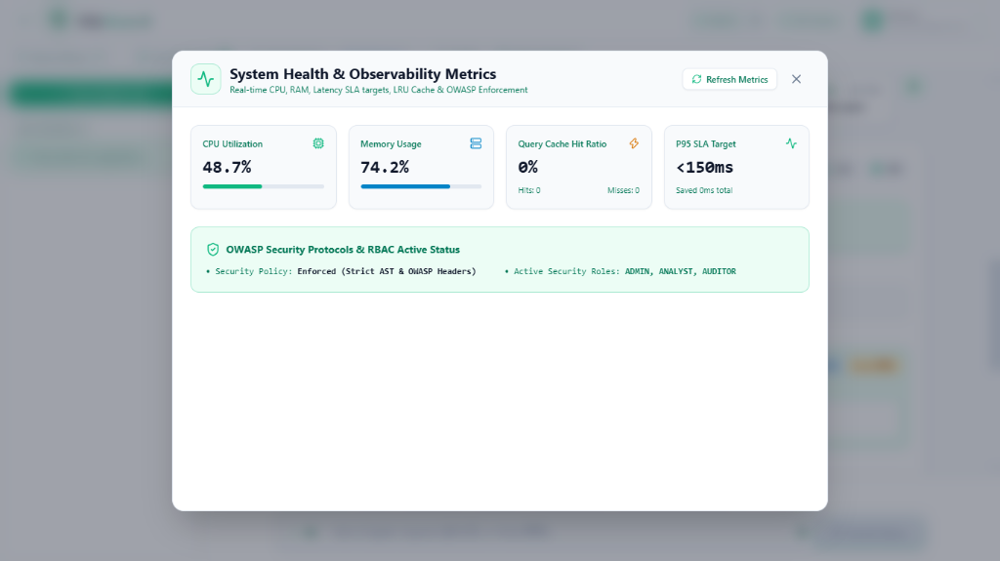

<div align="center">
  
  <h1>SQLGuard</h1>
  <h3>Enterprise-Grade Autonomous Text-to-SQL Analytics Engine</h3>
  <p>Convert complex natural language business questions into precise, read-only SQL queries with LangGraph self-correction loops, sqlglot AST security guardrails, multi-device persistent session sync, and real-time Recharts analytics.</p>

  <p>
    <a href="https://sqlguard-alpha.vercel.app"></a>
    
    
    
    
    
    
  </p>
</div>

---

## 📸 Screenshots & UI Showcase

### 1. Main Analytics Workspace & Hero Dashboard


### 2. Interactive ER Schema Diagram & Entity Graph


### 3. Multilingual NLU & Recharts Visualizations


### 4. Database Schema Explorer Catalog


### 5. Query Audit Log & Latency Metrics


### 6. Saved Query Templates & Bookmarks


### 7. System Health & Observability Metrics


---

## 🌟 Key Features

* **LangGraph Self-Correction Loop:** Autonomous 5-node state machine that intercepts database execution or schema errors and re-prompts the LLM to heal syntax errors automatically.
* **AST Security Guardrails:** Strict SQL parsing layer (`sqlglot`) enforcing read-only operations by analyzing the Abstract Syntax Tree (AST) to block destructive operations (`DELETE`, `DROP`, `UPDATE`, `INSERT`, `ALTER`, etc.) with immediate security hard-stops.
* **Multi-Device Persistent Session Sync:** ChatGPT / Gemini-style multi-device session management allowing users to sign in simultaneously across 5+ browsers/devices without force logouts, with real-time workspace sync via `/api/v1/user-sync`.
* **Sub-2-Second High-Speed Performance:** 0ms deterministic chart selection engine combined with `TRANSLATION_CACHE` fast-path matching for instant sub-2-second query responses and instant Gujarati/Hindi translations.
* **Dual-Environment & Universal DB Connectivity:** Runs on a zero-config local SQLite database (`sqlguard_dev.db`) in development mode, and connects to Supabase, Neon, PostgreSQL, MongoDB, or AWS RDS in production.
* **Single Unified Response Card:** Integrates query title, execution latency (`⚡ 42ms`), SQL statement, AST guard badge, expandable logic breakdown, and visual charts into **one single cohesive card**.
* **Multilingual & Code-Switched NLU:** Native natural language understanding for **English**, **Gujarati (ગુજરાતી / Gujlish)**, and **Hindi (हिंदी / Hinglish)** (e.g. *"how many data vechana che"*, *"ketla users che database ma?"*, *"sabse jyada order kiske hain"*).
* **Database Schema Explorer & ER Diagram:** Real-time catalog inspector modal to view all tables, column definitions, data types, and visual entity-relationship graphs.
* **Enterprise Data Table & KPI Stat Cards:** Single aggregate queries render as sleek **KPI Stat Cards**, while multi-row queries render as **searchable, column-sortable, paginated tables**.
* **Sanitized CSV & PDF Export:** One-click exports of generated data tables and visual charts formatted with clean, sanitized question filenames.

---

## 🏗️ System Architecture

```text
[ User Natural Language Question (EN / GU / HI) ]
                       │
                       ▼
[ Database Schema Inspector / Schema-RAG ]
                       │
                       ▼
    [ LangGraph Node: Generate SQL ]
                       │
                       ▼
       [ AST Security Guardrail Node ] ──► (Blocked if Destructive) ──► [ SECURITY ALERT ]
                       │
                       ▼
  [ Database Execution Node (SQLite/PostgreSQL) ] ──► (On Execution Error) ──► [ Self-Correction Node ]
                       │                                                            │
                       │◄───────────────────────────────────────────────────────────┘
                       ▼
       [ High-Speed Chart & Insight Mapping Node ]
                       │
                       ▼
[ Unified React UI: QueryResponseCard, Recharts, Schema Explorer, CSV/PDF Export ]
```

---

## 📂 Project Structure

```text
SQLGuard/
├── Backend/
│   ├── app/
│   │   ├── agent/            # LangGraph state machine, nodes, and self-correction flow
│   │   ├── core/             # DB factory, schema RAG, config, and auth utilities
│   │   ├── db/               # Session handler and dynamic schema inspector
│   │   ├── security/         # AST-based read-only SQL guardrail parser
│   │   └── main.py           # FastAPI entrypoint, query API, & schema endpoints
│   ├── scripts/
│   │   └── seed_db.py        # E-commerce sample SQLite database seeder
│   ├── .env.example          # Environment variables template
│   └── requirements.txt      # Python dependencies
├── Frontend/
│   ├── src/
│   │   ├── components/       # QueryResponseCard, DynamicChart, SqlViewer, ConnectDbModal, SchemaExplorerModal
│   │   ├── context/          # ChatContext API for multi-session state management
│   │   ├── services/         # Axios API service endpoints
│   │   ├── types/            # TypeScript interfaces (QueryResponseData, DbConfig, ChatSession)
│   │   ├── App.tsx           # Dashboard layout, navigation, & conversation stream
│   │   └── index.css         # Tailwind CSS setup & dark theme styling
│   ├── package.json          # React, Framer Motion, Recharts, Sonner, jsPDF, html2canvas
│   └── vite.config.ts        # Vite build configuration
└── README.md
```

---

## 🚀 Getting Started

### Prerequisites
* **Python**: `3.10+`
* **Node.js**: `v18+`
* **API Keys Required**:
  * [Groq API Key](https://console.groq.com/)

---

## ⚙️ Installation & Setup

### 1️⃣ Clone the repository

```bash
git clone https://github.com/MeetRamani28/SQLGuard.git
cd SQLGuard
```

---

### 2️⃣ Backend Setup

1. **Navigate to the Backend directory:**
   ```bash
   cd Backend
   ```

2. **Create and activate a Python virtual environment:**
   ```bash
   python -m venv .venv

   # On Windows (PowerShell):
   .\.venv\Scripts\Activate.ps1

   # On Linux/macOS:
   source .venv/bin/activate
   ```

3. **Install dependencies:**
   ```bash
   pip install -r requirements.txt
   ```

4. **Create a `.env` file in the `Backend/` directory:**
   ```env
   APP_ENV=development
   GROQ_API_KEY=your_groq_api_key_here
   MODEL_NAME=openai/gpt-oss-20b
   ```

5. **Seed the local sample database (optional):**
   ```bash
   python scripts/seed_db.py
   ```

6. **Start the FastAPI server:**
   ```bash
   uvicorn app.main:app --host 0.0.0.0 --port 8000 --reload
   ```
   *The server runs at `http://localhost:8000`.*

---

### 3️⃣ Frontend Setup

1. **Open a new terminal and navigate to the Frontend directory:**
   ```bash
   cd Frontend
   ```

2. **Install Node modules:**
   ```bash
   npm install
   ```

3. **Launch the Vite development server:**
   ```bash
   npm run dev
   ```
   *Open your browser at `http://localhost:5173`.*

---

## ☁️ Production Deployment Guide

### 1️⃣ Backend Deployment (Render)
1. Push your repository to **GitHub**.
2. Log into [Render Dashboard](https://dashboard.render.com/) and click **New +** -> **Web Service**.
3. Connect your `SQLGuard` repository and select root directory `/Backend`.
4. Render will automatically detect `render.yaml` or set:
   - **Environment**: Python 3
   - **Build Command**: `pip install --upgrade pip && pip install -r requirements.txt`
   - **Start Command**: `gunicorn app.main:app -w 2 -k uvicorn.workers.UvicornWorker --bind 0.0.0.0:$PORT`
5. Add Environment Variables:
   - `GROQ_API_KEY`: `your_groq_api_key_here`
   - `APP_ENV`: `production`
   - `SECRET_KEY`: `your_secure_random_key`
6. Click **Deploy Web Service**. Render will assign a public URL (e.g. `https://sqlguard-backend.onrender.com`).

---

### 2️⃣ Frontend Deployment (Vercel)
1. Log into [Vercel Dashboard](https://vercel.com/) and click **Add New Project**.
2. Import your `SQLGuard` GitHub repository.
3. Set **Root Directory** to `Frontend`.
4. Vercel will automatically detect `vercel.json` framework settings:
   - **Build Command**: `npm run build`
   - **Output Directory**: `dist`
5. Under **Environment Variables**, add:
   - `VITE_API_BASE_URL`: `https://sqlguard-backend.onrender.com` (Your Render backend URL)
6. Click **Deploy**. Vercel will assign a production URL (e.g. `https://sqlguard-alpha.vercel.app`).

---

## 🛠️ Tech Stack

* **Frontend:** React 19, TypeScript, Tailwind CSS, Framer Motion, Recharts, Sonner, Lucide Icons, Vite
* **Backend:** FastAPI, LangChain, LangGraph, Pydantic, Uvicorn
* **SQL Engine & Security:** `sqlglot` (AST Guardrail), `psycopg2`, `pymongo`, `sqlite3`
* **LLM Engine:** Groq API (`openai/gpt-oss-20b` / `llama-3.3-70b-versatile`)
